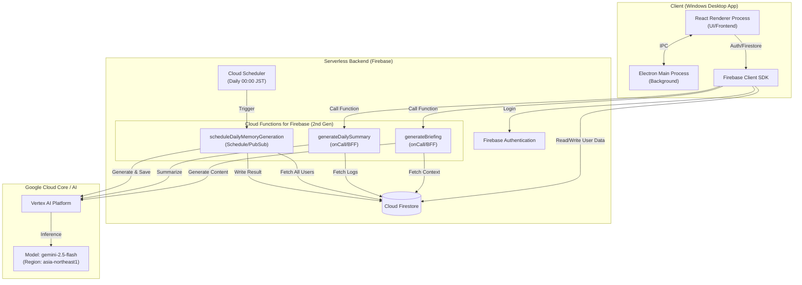

# AI秘書システム構成図 (v0.5.6)

## 全体アーキテクチャ

## コンポーネント詳細

| コンポーネント | 技術スタック | 役割 |
| :--- | :--- | :--- |
| **Client** | Electron, React, TypeScript, Vite | ユーザーインターフェース、OS機能連携（アクティブウィンドウ取得等） |
| **Auth** | Firebase Authentication | ユーザー認証、セッション管理 |
| **Database** | Cloud Firestore | ユーザーデータ、活動ログ、記憶データの永続化 |
| **Server** | Cloud Functions (Node.js 20) | BFF (Backend for Frontend)、バッチ処理、セキュリティ境界 |
| **AI Model** | Google Vertex AI | 生成AI基盤 (Gemini 2.5 Flash @ asia-northeast1) |
| **Scheduler** | Cloud Scheduler | 定期実行トリガー (毎日00:00 JST) |

## データフローの概要 (記憶生成)

1.  **活動ログ収集**: クライアント(PC)での操作・ウィンドウ情報をFirestoreにリアルタイム保存。
2.  **バッチ処理**: 毎日00:00に `scheduleDailyMemoryGeneration` が起動。
3.  **生成**: 全ユーザーの前日分のログを取得し、Vertex AIで「記憶（Memory）」を生成。
4.  **保存**: 生成された結果をFirestoreの `memories` サブコレクションに保存。
5.  **閲覧**: ユーザーはアプリを開いた際にFirestoreから記憶を取得して表示。
