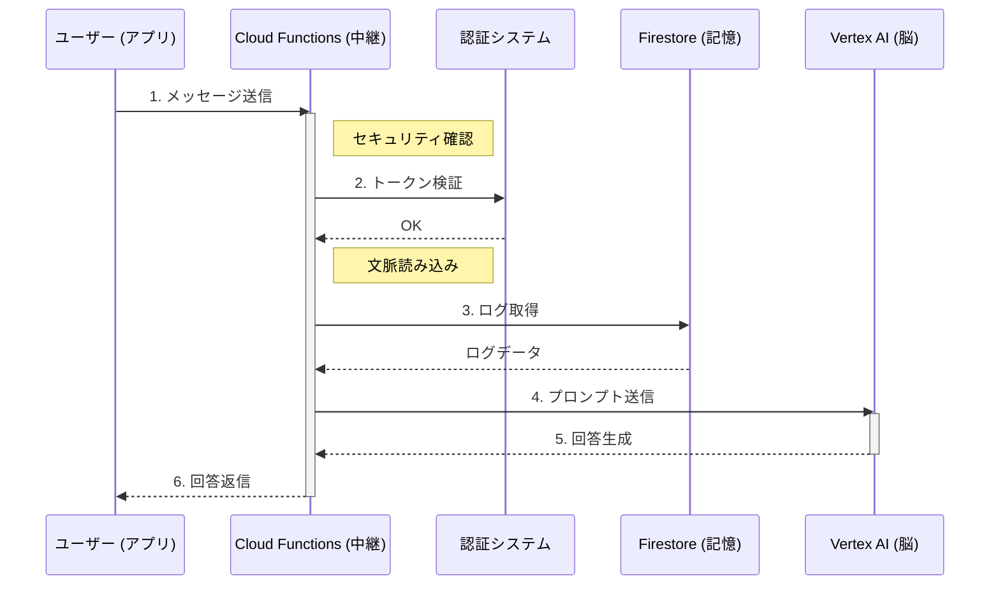

# チャット・アーキテクチャ データフロー図

**作成日**: 2026/02/04
**概要**: ElectronクライアントからVertex AIまでの通信フロー。

## 解説
1.  **認証**: Cloud Functions でトークンを検証します。
2.  **文脈読込**: FunctionsがFirestoreから必要な記憶（ログ）を読み込みます。
3.  **思考**: ユーザーのメッセージとログを合わせてVertex AIに送信します。
4.  **回答**: 生成されたテキストがアプリに返されます。
