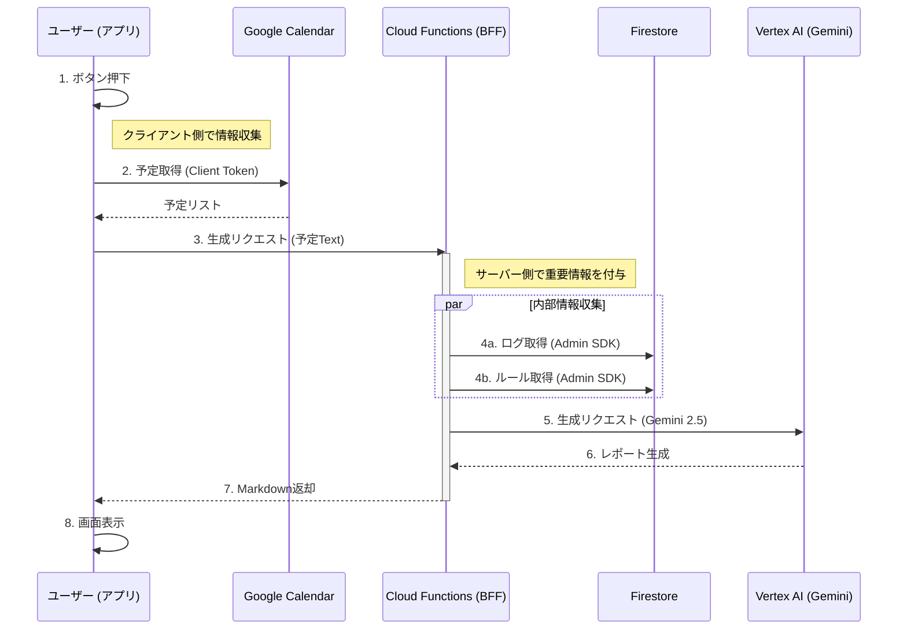

# エグゼクティブ・ブリーフィング データフロー図

**作成日**: 2026/02/05
**概要**: ElectronクライアントからCloud Functionsを経由してブリーフィングを生成する安全なフロー (BFFパターン)。

## 解説
1.  **予定取得 (Client)**: ユーザーのGoogleアカウント権限を使って、アプリ側でカレンダーを取得します。
2.  **リクエスト (BFF)**: 取得した予定テキストだけをサーバーに送り、「後はよろしく」と依頼します。
3.  **情報付加 (Server)**: サーバー(Cloud Functions)が、管理者権限でFirestoreから「過去の活動ログ」と「秘書マニュアル(SECRETARY.md)」を引き出します。
4.  **生成 (Server)**: 全ての情報を合わせてプロンプトを作り、Vertex AIに送信します。
5.  **完了**: ユーザーには最終的なレポートだけが返されます（プロンプトや内部構造は見えません）。

## セキュリティ・メリット
*   **🔑 API Key隠蔽**: Vertex AIのキーはサーバーにあり、アプリ内にはありません。
*   **👀 プロンプト保護**: 「あなたは一流の秘書です」という指示書はサーバーにあるため、ユーザーからは見えません。
*   **🔒 最小権限**: アプリは「自分の予定」を送るだけで、DBへの直接アクセス権を持つ必要がありません。
