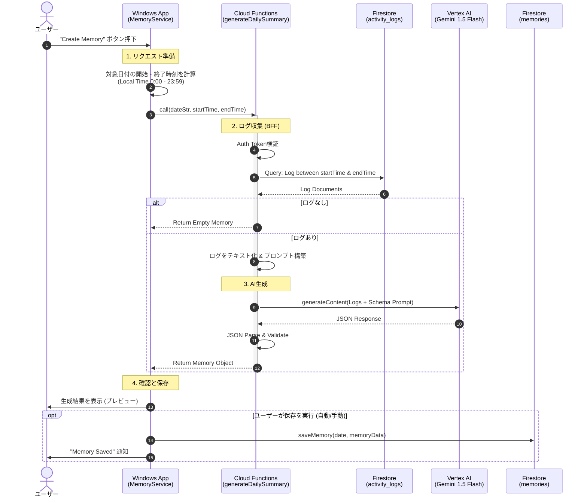

# 記憶生成 (Create Memory) フロー図

## 概要
ユーザーの1日の活動ログを分析し、構造化された「記憶 (Memory)」を生成するプロセス。
Ver 0.5.1 以降、**BFF (Backend for Frontend)** パターンを採用し、ログの取得と加工をサーバー側 (Cloud Functions) に集約しています。

## シーケンス図



## データ構造

### Request (Client -> Cloud Functions)
```json
{
  "dateStr": "2026-02-06",
  "startTime": "2026-02-05T15:00:00.000Z", // UTC (JST 0:00)
  "endTime": "2026-02-06T14:59:59.999Z"   // UTC (JST 23:59)
}
```

### Response (Cloud Functions -> Client)
```json
{
  "summary": "チャット機能の不具合修正と、新規プロジェクトの要件定義を実施。",
  "keyFocus": "安定性向上",
  "achievements": [
    "チャットログの重複バグを修正",
    "要件定義書v1.0を作成"
  ],
  "topics": ["BugFix", "Design", "Meeting"]
}
```
